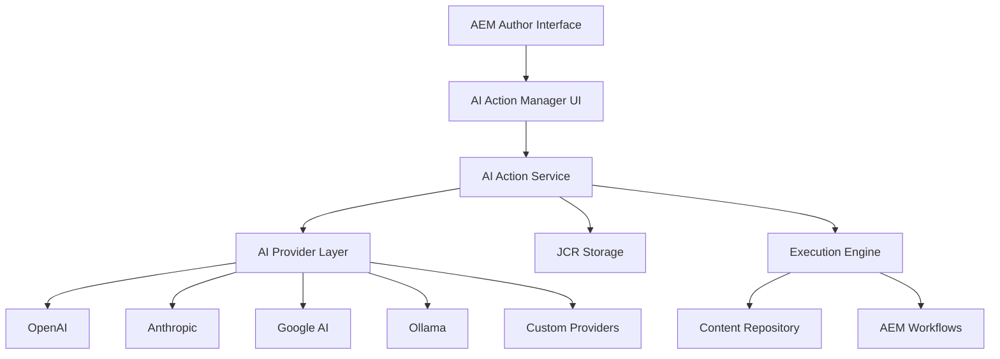

# AEM AI Actions Framework

**Transform Your Content Creation with AI-Powered Automation**

---

## 🚀 Overview

The AEM AI Actions Framework brings the power of artificial intelligence directly into Adobe Experience Manager, enabling teams to create, optimize, and manage content at scale with the same ease and flexibility as modern AI platforms like Contentful.


---

## ✨ Key Benefits

### 🎯 **Accelerate Content Creation**
- Generate hero banners, product descriptions, and blog posts in seconds
- Create consistent brand-aligned content across all channels
- Reduce content creation time by up to 80%

### 🧠 **Intelligent Optimization**
- Automatic SEO optimization with keyword integration
- Brand compliance checking and content scoring
- Multi-language translation and localization

### 📊 **Data-Driven Insights**
- Real-time content performance analysis
- Usage analytics and cost tracking
- A/B testing recommendations

### 🔒 **Enterprise-Grade Security**
- Role-based access control and audit trails
- Content moderation and safety filters
- GDPR compliance and data privacy controls

---

## 🛠️ What You Can Do

### Content Generation
```
✅ Hero Banners & Landing Pages
✅ Product Descriptions & E-commerce Content
✅ Blog Posts & Articles
✅ Email Templates & Campaigns
✅ Social Media Posts
✅ Press Releases & Announcements
```

### Content Enhancement
```
✅ SEO Optimization (Titles, Meta, Keywords)
✅ Content Rewriting & Repurposing
✅ Translation & Localization
✅ Content Summarization
✅ Readability Analysis
✅ Brand Compliance Checking
```

### Media Management
```
✅ Image Descriptions & Alt Text
✅ Visual Content Analysis
✅ Asset Tagging & Categorization
✅ DAM Integration
```

---

## 🏗️ Architecture



---

## 🎨 User Interface

### Action Manager Dashboard
- **Visual Action Library**: Browse and manage AI actions by category
- **Real-time Status**: Monitor execution progress and results
- **Performance Analytics**: Track usage, costs, and success rates
- **Quick Actions**: One-click execution for common tasks

### Content Creation Interface
- **Template Selection**: Choose from 18+ pre-configured templates
- **Custom Input**: Define variables and parameters
- **Preview Mode**: Review results before applying
- **Batch Processing**: Apply actions to multiple assets

### Execution Monitoring
- **Live Progress**: Real-time execution status updates
- **Error Handling**: Detailed error messages and retry options
- **Cost Tracking**: Monitor token usage and expenses
- **Audit Logs**: Complete execution history for compliance

---

## 🤖 AI Provider Support

### Cloud Providers
| Provider | Models | Use Cases | Cost Efficiency |
|----------|--------|-----------|---------------|
| **OpenAI** | GPT-4, GPT-3.5 | General content, SEO | ★★★☆☆ |
| **Anthropic** | Claude-3 Family | Brand content, analysis | ★★★★☆ |
| **Google AI** | Gemini Pro | Multimodal, translation | ★★★★☆ |

### Local Options
| Provider | Models | Privacy | Performance |
|----------|--------|---------|-------------|
| **Ollama** | LLaMA, Mistral | 100% | ★★★☆☆ |
| **Custom API** | Your Models | Flexible | ★★★★★ |

---

## 📚 Template Library

### 🔥 Most Popular Templates

#### 1. Hero Banner Generator
**Perfect for:** Landing pages, marketing campaigns
```
Input: Company info, product details, target audience
Output: Headline, subheadline, CTA, visual description
Time: < 5 seconds
```

#### 2. Product Description Generator
**Perfect for:** E-commerce, product catalogs
```
Input: Product features, benefits, target market
Output: Short/long descriptions, features list, SEO keywords
Time: < 8 seconds
```

#### 3. SEO Content Optimizer
**Perfect for:** Blog posts, articles, web pages
```
Input: Original content, target keywords
Output: Optimized content, meta tags, SEO score
Time: < 10 seconds
```

#### 4. Multi-Platform Social Media
**Perfect for:** Social media campaigns
```
Input: Campaign message, platforms, hashtags
Output: Platform-specific posts, engagement prompts
Time: < 12 seconds
```

### 📋 Complete Template List
- **Content Creation** (5 templates)
- **SEO & Metadata** (4 templates)
- **Content Enhancement** (4 templates)
- **Analysis & Compliance** (3 templates)
- **Media & Images** (2 templates)

---

## 🚀 Quick Start Guide

### Step 1: Configure AI Providers
```bash
# Set environment variables
export OPENAI_API_KEY="sk-your-key-here"
export ANTHROPIC_API_KEY="sk-ant-your-key-here"
export GOOGLE_AI_API_KEY="your-google-key-here"
```

### Step 2: Choose Your Template
```
Navigate to AI Actions → Select "Hero Banner Generator"
→ Configure your brand parameters
→ Test with sample data
→ Save your custom template
```

### Step 3: Generate Content
```
Select resource in AEM → Choose "AI Actions"
→ Pick your template → Input content details
→ Preview result → Apply to resource
```

### Step 4: Monitor & Optimize
```
View execution history → Analyze performance
→ Adjust templates → Scale successful patterns
```

---

## 📊 Real-World Results

### Customer Success Stories

#### Global Retail Brand
- **Challenge:** Creating consistent product descriptions across 50+ markets
- **Solution:** Product Description Generator with brand guidelines
- **Results:** 75% reduction in creation time, 40% increase in SEO traffic

#### Enterprise Software Company
- **Challenge:** Maintaining blog content quality at scale
- **Solution:** SEO Content Optimizer with brand compliance checking
- **Results:** 3x more content published, 60% improvement in search rankings

#### Travel & Hospitality Brand
- **Challenge:** Multilingual content for 20+ languages
- **Solution:** Translation template with cultural adaptation
- **Results:** 90% faster localization, 85% cost reduction

---

## 🔧 Technical Features

### Performance & Scalability
- **Concurrent Execution:** Up to 10 simultaneous AI actions
- **Smart Caching:** Result caching for similar requests
- **Rate Limiting:** Configurable API rate limits
- **Fallback Support:** Automatic provider switching

### Integration Capabilities
- **AEM Workflows:** Native integration with AEM workflow engine
- **DAM Systems:** Direct integration with digital asset management
- **Analytics Platforms:** Content performance tracking
- **Marketing Automation:** Campaign content generation

### Security & Compliance
- **Access Control:** Role-based permissions by user group
- **Content Moderation:** Automated safety and brand compliance
- **Audit Trails:** Complete execution logging
- **Data Privacy:** On-premises options with Ollama

---

## 📈 Monitoring & Analytics

### Dashboard Metrics
```
📊 Usage Overview
- Total Actions Created: 25
- Active Actions: 18
- Daily Executions: 142
- Success Rate: 97.4%

💰 Cost Tracking
- Monthly Spend: $456.78
- Cost per Execution: $3.21
- Budget Remaining: $543.22

⚡ Performance
- Average Response Time: 8.2s
- Fastest Provider: Anthropic (5.1s)
- Error Rate: 2.6%
```

### Action Performance
```
Top Performing Actions:
1. Hero Banner Generator (342 executions)
2. Product Descriptions (287 executions)
3. SEO Optimizer (198 executions)

Cost Efficiency:
1. Ollama Local: $0.12 per execution
2. Anthropic: $0.45 per execution
3. OpenAI: $0.67 per execution
```

---

## 🎯 Use Case Examples

### Marketing Team
**Scenario:** Launching a new product campaign
```
1. Generate hero banner for landing page (Hero Banner Generator)
2. Create product descriptions (Product Description Generator)
3. Write email campaign (Email Template Generator)
4. Create social media posts (Social Media Generator)
5. Optimize all content for SEO (SEO Optimizer)

Total Time: < 2 minutes
Traditional Time: 4-6 hours
Time Saved: 95%
```

### E-commerce Manager
**Scenario:** Adding 100 new products to catalog
```
Batch Processing:
1. Upload product spreadsheet
2. Apply Product Description Generator
3. Auto-generate alt text for images
4. Create category descriptions
5. Optimize for search engines

Total Time: 15 minutes
Traditional Time: 2-3 days
Time Saved: 99%
```

### Content Strategist
**Scenario:** Repurposing blog content
```
Content Repurposing:
1. Summarize long-form article (Content Summarizer)
2. Rewrite for different audience (Content Rewriter)
3. Create social media snippets (Social Media Generator)
4. Generate email newsletter (Email Generator)
5. Translate for international markets (Translation)

Total Time: 5 minutes
Traditional Time: 2-3 hours
Time Saved: 97%
```

---

## 🔐 Security Features

### Access Control
- **User Groups:** Assign permissions by team/role
- **Resource Security:** Restrict actions by content path
- **API Authentication:** Secure endpoint access
- **Session Management:** Automatic timeout and logout

### Content Safety
- **Brand Guidelines:** Automatic compliance checking
- **Content Moderation:** Inappropriate content filtering
- **Legal Compliance:** Trademark and disclaimer checking
- **Cultural Sensitivity:** Market-specific content adaptation

### Data Privacy
- **Local Processing:** Ollama for on-premises AI
- **Data Retention:** Configurable retention policies
- **Right to Deletion**: GDPR compliance
- **Audit Logs**: Complete access and modification tracking

---

## 🚀 Getting Started

### Installation Requirements
- **AEM Version:** 6.5+ or Cloud Service
- **Java:** JDK 11+
- **Memory:** 4GB+ RAM recommended
- **AI Provider:** API keys for chosen providers

### Quick Installation
```bash
# Clone and build
git clone aem-ai-actions-framework.git
cd aem-ai-actions-framework
mvn clean install -PautoInstallPackage

# Configure providers
# Set API keys in environment variables
# Restart AEM service

# Access interface
# Navigate to http://localhost:4502/aem/ai-actions
```

### First Steps
1. **Configure Providers:** Set up AI provider API keys
2. **Explore Templates:** Browse the template library
3. **Test Actions:** Try sample executions
4. **Customize Templates:** Adapt templates to your brand
5. **Train Team:** Onboard content creators

---

## 💡 Tips & Best Practices

### Content Quality
- **Start Small:** Test with simple content first
- **Review Results:** Always review AI-generated content
- **Brand Alignment:** Configure brand guidelines early
- **Iterate:** Refine templates based on results

### Cost Optimization
- **Choose Right Provider:** Match provider to task complexity
- **Use Caching:** Enable result caching for repeated tasks
- **Monitor Usage:** Track costs and set budget limits
- **Batch Processing:** Group similar requests together

### Team Adoption
- **Start Templates:** Begin with pre-configured templates
- **Training:** Provide team training and documentation
- **Feedback Loop:** Collect user feedback for improvements
- **Success Stories:** Share wins across the organization

---

## 🔮 Roadmap

### Q2 2026 - Advanced Features
- [ ] **AI Assistant Chat**: Interactive content creation
- [ ] **Fine-tuning**: Custom model training on brand content
- [ ] **Voice Generation**: Audio content creation
- [ ] **Video Analysis**: AI-powered video content

### Q3 2026 - Workflow Integration
- [ ] **Advanced Workflows**: Multi-step AI action chains
- [ ] **Predictive Analytics**: Content performance prediction
- [ ] **A/B Testing**: AI-powered optimization testing
- [ ] **Personalization Engine**: Dynamic content personalization

### Q4 2026 - Enterprise Features
- [ ] **Multi-tenant Support**: Shared services architecture
- [ ] **Advanced Analytics**: Deep insights and reporting
- [ ] **Integration Hub**: Extended third-party connections
- [ ] **Mobile App**: On-the-go content management

---

## 📞 Support & Resources

### Documentation
- **📖 User Guide**: Step-by-step instructions
- **🛠️ Developer Docs**: API reference and customization
- **🎥 Video Tutorials**: Interactive learning
- **❓ FAQ**: Common questions and solutions

### Community
- **💬 Developer Forum**: Technical discussions
- **🐛 Issue Tracking**: Bug reports and feature requests
- **📊 Best Practices**: Community-contributed templates
- **🏆 Success Stories**: Customer case studies

### Enterprise Support
- **🔧 Dedicated Support**: SLA-backed technical assistance
- **👨‍💼 Consulting**: Implementation and optimization services
- **🎓 Training Programs**: Team certification and workshops
- **🔄 Managed Services**: Fully managed AI operations

---

## 🎉 Transform Your Content Today

The AEM AI Actions Framework is more than just a tool—it's a complete content transformation platform. By bringing the power of AI directly into AEM, teams can:

- **Create 10x more content** with the same resources
- **Maintain brand consistency** across all channels
- **Optimize for SEO** automatically
- **Reduce content costs** by up to 80%
- **Launch campaigns faster** than ever before

### Ready to Get Started?

1. **📞 Schedule Demo**: See the framework in action
2. **🚀 Start Trial**: Test with your content
3. **📈 Plan Implementation**: Custom rollout strategy
4. **🎯 Achieve Results**: Transform your content operations

---

**Start Your AI Content Journey Today**

*Transform the way you create, optimize, and manage content in AEM.*

[Request Demo] [Start Trial] [Contact Sales]

---

**© 2026 AEM AI Actions Framework. Powered by cutting-edge AI technology.**